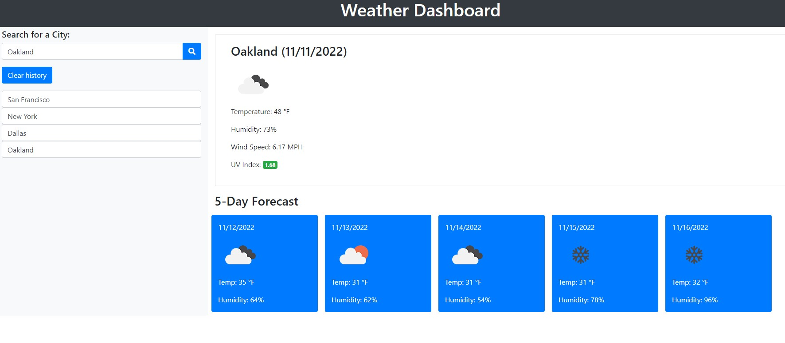

# weather-dashboard

## 1. Description
This application allows the user to search up any city in the world and get real time information about what the weather is like in the city.

DEPLOYMENT:
 [DIRECT LINK](https://cbushehry.github.io/weather-dashboard/) | [GITHUB REPOSITORY](https://github.com/cbushehry/weather-dashboard)

## 2. Features
 * Search city function
 * 5-Day weather forecast
 * Current Temperature, Humidity, Wind Speed & UV Index
 * Icons for Sunny, Cloudy, Raining & Snowing
 * Clear history button

 

## 3. Credits / Contact
This application was made by Cameron Bushehry

Contact Me: c.bushehry@gmail.com